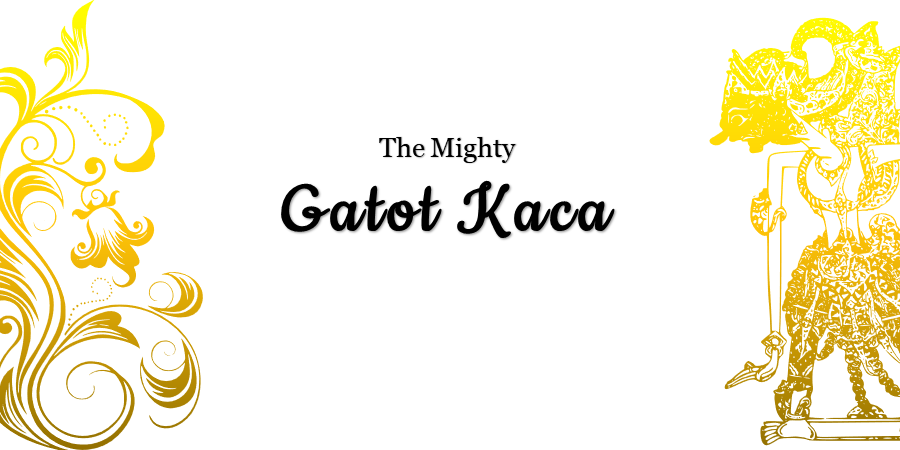
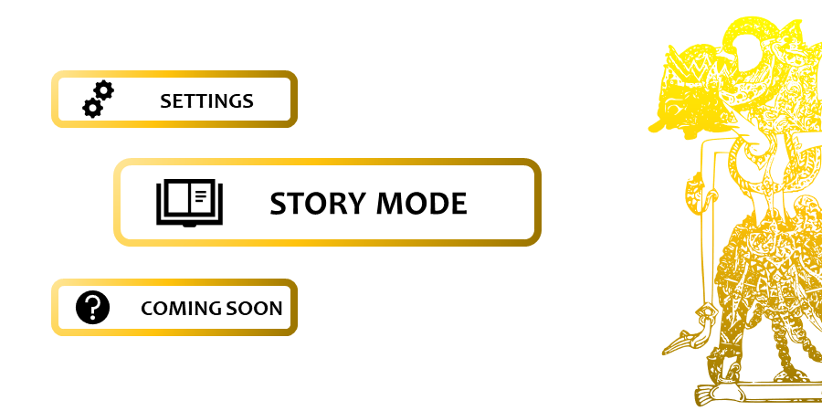
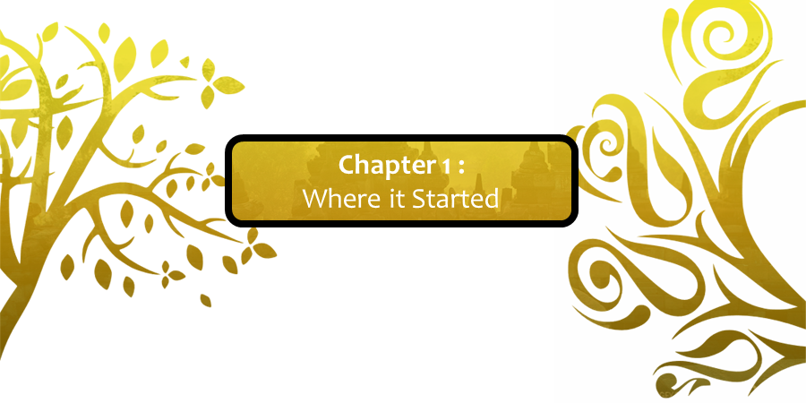

# The Mighty Gatot Kaca
### Brief Description
2D Platformer Game Franchise by Enveriesage Studios based on Gatot Kaca Stories using Raylib. Original License by Enveriesage Studios.
### Installation Guide
1. Download all files in this repository. (Make sure it has the same location format like in this repository)
2. Run `The Mighty Gatot Kaca.exe` to play the game.
### Editors Guide
1. Download all files in this repository. (Make sure it has the same location format like in this repository)
2. Download `Raylib` from www.raylib.com .
3. Run `Notepad ++ for Raylib`.
4. Open `Source_Code.c`.
### Note : further information about `Raylib` visit www.raylib.com.
### Documentation
     
### License
